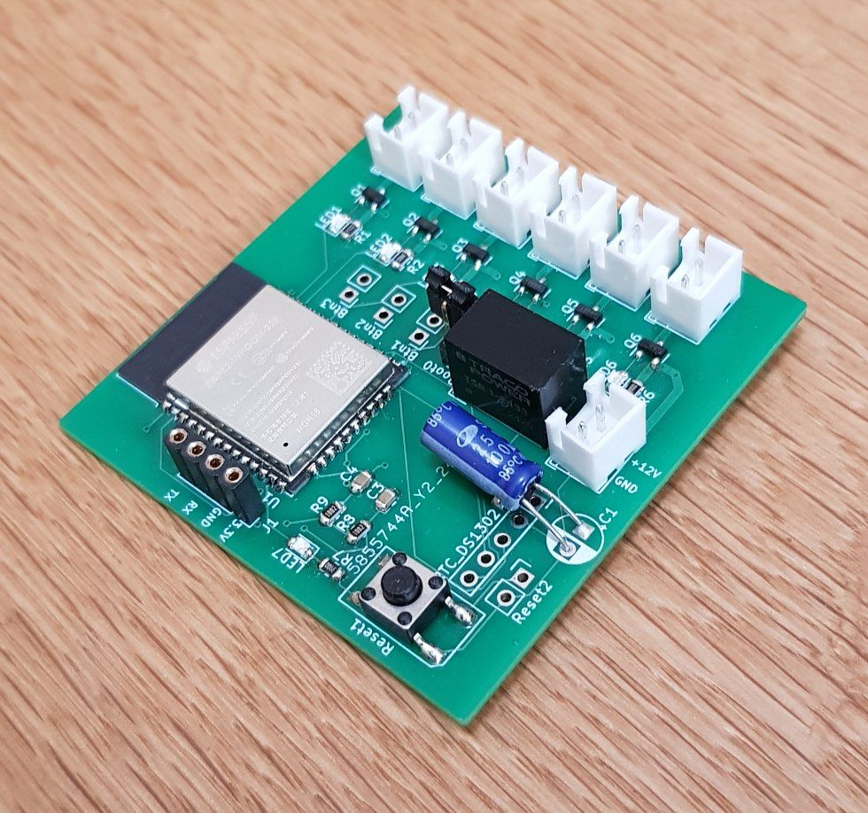

# HexaSwitch - 6-Channel Switch for Tasmota

This project is a custom-designed printed circuit board (PCB) for a Tasmota-compatible IoT device based on the ESP32 microcontroller. It allows switching of **6 loads**, with each channel capable of handling up to **2 Amps**. The device contains a real-time clock such that the device can also run on an independent time base. 

---

## Features

- **ESP32-based** controller compatible with [Tasmota firmware](https://tasmota.github.io/)
- **6 independent load switching channels** (up to 2A per channel)
- Supports power input from **5V to 24V**
- Optional **Real-Time Clock (RTC)** connector (not required for operation)
- Custom PCB designed using **KiCad**

---

## Hardware Details

- Power Supply: 5–24V DC input  
- Switching: 6 channels, each capable of switching loads up to 2A  
- Microcontroller: ESP32  
- Optional RTC interface for time-sensitive automation  
- Connectors and layout optimized for ease of assembly and reliability

---

## Usage

1. Flash the ESP32 with [Tasmota firmware](https://tasmota.github.io/) configured for your load switching use case.  
2. Assemble the PCB and connect loads to the output channels.  
4. Power the device with a DC supply between 5V and 24V.  
5. Use Tasmota’s web interface or MQTT to control each channel independently.

---

## License

This project is released under the MIT License. See [LICENSE](LICENSE) for details.

---

## Screenshots / Photos

